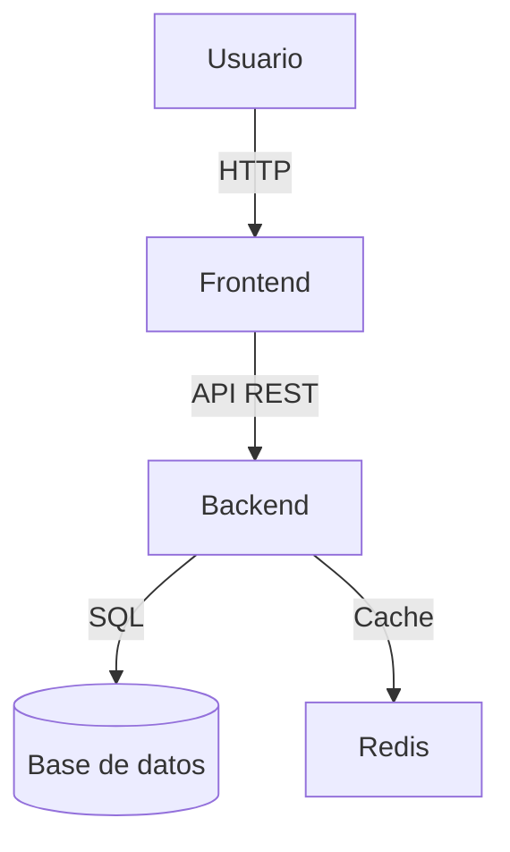

# Guía de imágenes para tu README

Esta carpeta contiene los assets visuales del proyecto. Aquí encontrarás qué imágenes necesitas y cómo crearlas.

---

## Archivos a agregar en esta carpeta

| Archivo | Dimensiones recomendadas | Herramienta sugerida |
|---|---|---|
| `banner.png` | 1280 × 640 px | Canva, Figma, Photoshop |
| `screenshot.png` | 1200 × 700 px | Captura de pantalla del SO |
| `screenshot-2.png` | 1200 × 700 px | Captura de pantalla del SO |
| `demo.gif` | 700 × 400 px | ScreenToGif, LICEcap, Gifski |
| `architecture.png` | 900 × 600 px | draw.io, Excalidraw, Lucidchart |
| `logo.png` | 200 × 200 px (cuadrado) | Canva, Figma |

---

## Cómo crear cada imagen

### Banner (`banner.png`)

El banner es lo primero que ve el visitante. Debe incluir:
- Nombre del proyecto
- Descripción muy corta (tagline)
- Colores del proyecto

**Herramientas gratuitas:**
- [Canva](https://canva.com) → Busca "GitHub Banner" en plantillas
- [Figma](https://figma.com) → Crea uno desde cero con tus colores
- [carbon.now.sh](https://carbon.now.sh) → Para proyectos de código (genera imágenes de código bonitas)

**Tamaño:** 1280 × 640 px, exportar como PNG.

---

### Screenshots (`screenshot.png`, `screenshot-2.png`)

Capturas de pantalla reales de tu proyecto en funcionamiento.

**En Windows:**
```
Win + Shift + S  → Recorte de pantalla
```

**En Mac:**
```
Cmd + Shift + 4  → Selección de área
```

**Consejos:**
- Usa datos de ejemplo, no datos reales de usuarios
- Captura el estado más impresionante o representativo
- Si es una UI, asegúrate de que la ventana esté maximizada

---

### GIF Demo (`demo.gif`)

Un GIF animado que muestre tu proyecto en acción es el elemento más llamativo de un README.

**Herramientas recomendadas:**

| Herramienta | OS | Costo | Link |
|---|---|---|---|
| ScreenToGif | Windows | Gratis | [screentogif.com](https://www.screentogif.com/) |
| LICEcap | Win / Mac | Gratis | [cockos.com/licecap](https://www.cockos.com/licecap/) |
| Gifski | Mac | Gratis | [gif.ski](https://gif.ski/) |
| Peek | Linux | Gratis | [GitHub](https://github.com/phw/peek) |
| Gyroflow Toolbox | Mac | Gratis | App Store |

**Pasos con ScreenToGif:**
1. Abre ScreenToGif → Grabadora
2. Posiciona el recuadro sobre tu aplicación
3. Graba el flujo principal (15-30 segundos máximo)
4. Exporta como GIF optimizado

**Tamaño ideal:** máximo 5 MB para que cargue rápido en GitHub.

---

### Diagrama de arquitectura (`architecture.png`)

Para proyectos con múltiples servicios o capas.

**Herramientas gratuitas:**
- [Excalidraw](https://excalidraw.com) → Estilo sketch, muy popular en GitHub
- [draw.io](https://draw.io) → Más formal, muchos iconos de servicios cloud
- [Mermaid](https://mermaid.live) → Diagramas en texto plano, se renderiza en GitHub

**Ejemplo Mermaid (funciona directamente en README.md):**



---

## Mientras no tengas las imágenes

Usa estos placeholders en tu README hasta tener las imágenes reales:

```html
<!-- Banner placeholder -->


<!-- Screenshot placeholder -->


<!-- Demo placeholder -->

```

---

## Optimización de imágenes

Antes de subir imágenes al repo, optimízalas para reducir el tamaño:

- **PNG:** [TinyPNG](https://tinypng.com) — compresión sin pérdida visible
- **GIF:** [Ezgif](https://ezgif.com/optimize) — reduce tamaño del GIF
- **General:** Máximo 5 MB por archivo en un repo de GitHub
