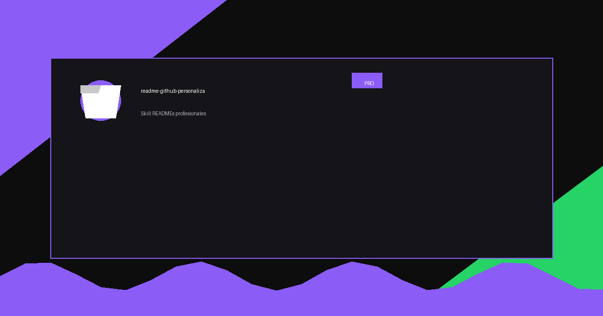

<p align="center">
  
</p>

<h1 align="center">MiApp Web</h1>

<p align="center">
  <strong>Plataforma web para gestionar tareas de equipo en tiempo real, con notificaciones y colaboración en vivo.</strong>
</p>

<p align="center">
  
  
  
  
</p>

<p align="center">
  <a href="#-acerca-del-proyecto">Acerca</a> •
  <a href="#-características">Características</a> •
  <a href="#-demo">Demo</a> •
  <a href="#-comenzando">Comenzando</a> •
  <a href="#-uso">Uso</a> •
  <a href="#-contacto">Contacto</a>
</p>

---

## 📖 Acerca del Proyecto

<p align="center">
  
</p>

MiApp Web resuelve el caos de los equipos remotos: centraliza tareas, asignaciones y comentarios en un solo lugar con actualizaciones en tiempo real. Sin recargar la página, sin emails de seguimiento.

### 🛠️ Construido Con

<p align="left">
  
  
  
  
  
</p>

---

## ✨ Características

| Característica | Descripción |
|---|---|
| ⚡ **Tiempo real** | Actualizaciones instantáneas con Supabase Realtime |
| 🔒 **Autenticación** | Login con Google, GitHub y email/password |
| 📋 **Tableros Kanban** | Arrastra y suelta tareas entre columnas |
| 👥 **Colaboración** | Asigna tareas, menciona compañeros con @usuario |
| 📱 **Responsivo** | Funciona perfecto en móvil, tablet y escritorio |
| 🔔 **Notificaciones** | Alertas en tiempo real para menciones y vencimientos |

---

## 🎬 Demo

<p align="center">
  
</p>

🌐 [Ver demo en vivo](https://miapp-demo.vercel.app)

---

## 🚀 Comenzando

### Prerrequisitos

- Node.js `>= 18.0`
- Cuenta en [Supabase](https://supabase.com) (gratis)

### Instalación

```sh
git clone https://github.com/oscaromargp/miapp-web.git
cd miapp-web
npm install
cp .env.example .env.local
# Agrega tus credenciales de Supabase en .env.local
npm run dev
```

Abre [http://localhost:3000](http://localhost:3000) en tu navegador.

---

## 💡 Uso

### Crear una tarea

```ts
const tarea = await crearTarea({
  titulo: "Diseñar nueva landing page",
  asignadoA: "usuario@ejemplo.com",
  prioridad: "alta",
  fechaVencimiento: "2026-05-01"
});
```

<p align="center">
  
  &nbsp;&nbsp;
  
</p>

---

## 💖 Apoya este Proyecto

<p align="center">
  
</p>

> Dirección XRP: `rBthUCndKy3Xbb19Ln4xkZeMwusX9NrYfj`

---

## 📬 Contacto

<p align="center">
  <a href="https://oscaromargp.github.io/Oscaromargp/">
    
  </a>
  &nbsp;
  <a href="https://github.com/oscaromargp">
    
  </a>
</p>

## 📄 Licencia

MIT © [Oscar Omar Gómez Peña](https://github.com/oscaromargp)
